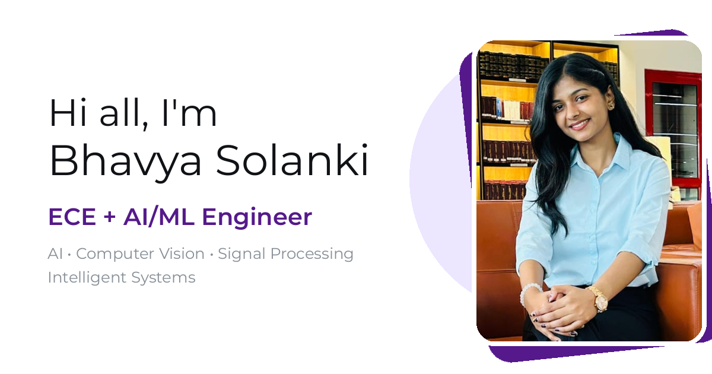

# 🤖 Bhavya Solanki — AI/ML Engineer Portfolio

<p align="center">
  
</p>

<h3 align="center">
Building intelligent systems that connect AI, electronics, signals, and real-world engineering 🚀
</h3>

<p align="center">
  <a href="https://bhavyasolanki31.github.io/My-Portfolio/">🌐 Live Portfolio</a> •
  <a href="https://github.com/BhavyaSolanki31">💻 GitHub</a> •
  <a href="https://www.linkedin.com/in/bhavya-solanki-267011309/">🔗 LinkedIn</a>
</p>

---

## 👋 About Me

Hi, I'm **Bhavya Solanki**, a 4th-year **B.Tech Electronics & Communication Engineering (AI & ML)** student passionate about building intelligent systems that combine:

- Artificial Intelligence
- Machine Learning
- Computer Vision
- Signal Processing
- Embedded Systems
- Electronics Engineering

I enjoy creating practical solutions by combining AI algorithms, software development, and hardware-oriented engineering.

---

# 🌟 Portfolio Overview

This portfolio represents my engineering journey and showcases:

- 🚀 AI/ML projects and implementations
- 👁️ Computer vision applications
- ⚡ Electronics and VLSI experience
- 💼 Industry internship experience
- 📜 Certifications and achievements
- 🛠 Technical skills and tools

---

# ✨ Features

- Modern responsive portfolio design
- Light & dark theme support
- Smooth animations and interactions
- Interactive project showcase
- Experience and certification sections
- Resume download option
- Mobile-friendly UI
- Optimized performance using React + Vite

---

# 🛠 Tech Stack

## Frontend

- React.js
- Vite
- Tailwind CSS
- JavaScript
- Lucide Icons

## Artificial Intelligence & Machine Learning

- Python
- TensorFlow
- NumPy
- Pandas
- Machine Learning Algorithms
- Deep Learning
- Time-Series Forecasting
- Anomaly Detection

## Computer Vision & Image Processing

- OpenCV
- Image Processing
- OCR
- Computer Vision Pipelines
- Image Validation

## Electronics & Core Engineering

- Digital Electronics
- Analog Electronics
- Digital Signal Processing
- VLSI Fundamentals
- Embedded Systems
- IoT

## Automation & Testing

- Python Automation
- Pytest
- Robot Framework
- Selenium
- Playwright
- API Testing

## Tools & Platforms

- Git
- GitHub
- VS Code
- Arduino IDE
- Cadence Virtuoso

---

# 💼 Experience

## 🔴 R&D Intern — Barco Electronic Systems Pvt. Ltd.

**Noida, India | July 2026 – August 2026**

Worked on computer vision-based validation and automation workflows.

### Key Contributions

- Developed a Python/OpenCV image-validation pipeline with multiple quality metrics and OCR validation for automated PASS/FAIL classification.
- Optimized camera-based image acquisition through sharpest-frame selection, display detection, cropping, and OCR preprocessing.
- Enhanced testing workflows using Pytest, Robot Framework, Playwright, and API validation.

---

## 🟣 Digital Electronics & VLSI Intern — Codec Technologies India

Worked on digital electronics and semiconductor-oriented design concepts.

### Key Contributions

- Applied digital electronics concepts for circuit design and analysis.
- Explored CMOS/VLSI fundamentals and simulation workflows.
- Worked on semiconductor-based design understanding and digital system implementation.

---

# 🚀 Featured Projects

## ⚡ AI Powered Smart Energy Meter

**Machine Learning | IoT | Time-Series Forecasting**

An intelligent energy monitoring system using AI techniques.

### Highlights

- Developed LSTM-based electricity consumption forecasting model.
- Implemented Isolation Forest-based anomaly detection.
- Created real-time energy monitoring visualization.

---

## 🔐 DSP Based Secure Image Authentication System

**MATLAB | Digital Signal Processing**

A secure image processing system using DSP techniques.

### Highlights

- Implemented image embedding and recovery techniques.
- Applied bit-plane slicing and signal processing concepts.
- Evaluated image quality using PSNR analysis.

---

## 🎙 Real-Time Speech Emotion Detection

**MATLAB | Machine Learning**

A speech-based emotion recognition system.

### Highlights

- Extracted MFCC-based audio features.
- Built emotion classification workflow.
- Developed interactive visualization dashboard.

---

## 📄 ATS Resume Analyzer

**AI | Web Application**

An intelligent resume evaluation platform.

### Highlights

- Automated resume parsing and analysis.
- Generated ATS compatibility scores.
- Provided keyword-based improvement suggestions.

---

# 🎓 Education

## Galgotias University

**B.Tech Electronics & Communication Engineering (AI & ML)**

**2023 – 2027**

CGPA: 8.9+

---

# 🏆 Certifications

- Machine Learning Onramp — MathWorks
- Data Structures & Algorithms Using Java — Infosys Springboard
- Introduction to Generative AI Studio — Google Cloud
- AI Bootcamp — NIELIT
- Analog ICs & Semiconductor Advancements — NIT Delhi
- Machine Learning — Internshala

---

# 📂 Project Structure

```
src/
│
├── components/        # Reusable UI components
├── sections/          # Portfolio sections
├── data/              # Projects, skills and experience data
├── hooks/             # Custom React hooks
└── assets/            # Images, logos and icons

public/
├── certificates/      # Certificate files
├── images/            # Public assets
└── resume/            # Resume file
```

---

# ⚙️ Run Locally

### Requirements

- Node.js 20+

### Clone Repository

```bash
git clone https://github.com/BhavyaSolanki31/bhavya-solanki-portfolio.git
```

### Install Dependencies

```bash
npm install
```

### Start Development Server

```bash
npm run dev
```

### Production Build

```bash
npm run build
```

---

# 🌐 Deployment

This portfolio can be deployed using:

- GitHub Pages
- Vercel
- Netlify

---

# 📫 Connect With Me

GitHub:  
https://github.com/BhavyaSolanki31

LinkedIn:  
https://www.linkedin.com/in/bhavya-solanki-267011309/

---

⭐ If you like my work, consider starring this repository!

© 2026 Bhavya Solanki
