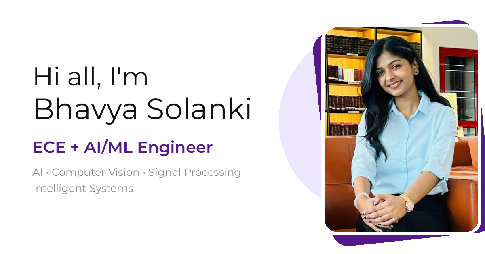

# 🤖 Bhavya Solanki — AI/ML Engineer Portfolio

<p align="center">
  
</p>

<h3 align="center">
Building intelligent systems that connect AI, electronics, signals, and real-world engineering 🚀
</h3>

<p align="center">
  <a href="https://bhavyasolanki31.github.io/My-Portfolio/">🌐 Live Portfolio</a> •
  <a href="https://github.com/BhavyaSolanki31">💻 GitHub</a> •
  <a href="https://www.linkedin.com/in/bhavya-solanki-267011309/">🔗 LinkedIn</a>
</p>

---

## 👋 About Me

Hi, I'm **Bhavya Solanki**, a 4th-year **B.Tech Electronics & Communication Engineering (AI & ML)** student passionate about building intelligent systems that combine:

- Artificial Intelligence
- Machine Learning
- Computer Vision
- Embedded AI Systems
- Electronics Engineering
- Automation & Testing
- Signal Processing

I enjoy creating practical solutions by combining AI algorithms, software development, and hardware-oriented engineering.

---

# 🌟 Portfolio Overview

This portfolio represents my engineering journey and showcases:

- 🚀 AI/ML projects and implementations
- 👁️ Computer vision applications
- ⚡ Electronics and VLSI experience
- 💼 Industry internship experience
- 📜 Certifications and achievements
- 🛠 Technical skills and tools

---

# ✨ Features

- Modern responsive portfolio design
- Light & dark theme support
- Smooth animations and interactions
- Interactive project showcase
- Experience and certification sections
- Resume download option
- Mobile-friendly UI
- Optimized performance using React + Vite

---

# 🛠 Tech Stack

## Frontend

- React.js
- Vite
- Tailwind CSS
- JavaScript
- Lucide Icons

## Artificial Intelligence & Machine Learning

- Python
- TensorFlow
- NumPy
- Pandas
- Machine Learning Algorithms
- Deep Learning
- Time-Series Forecasting
- Anomaly Detection

## Computer Vision & Image Processing

- OpenCV
- Image Processing
- OCR
- Computer Vision Pipelines
- Image Validation

## Electronics & Core Engineering

- Digital Electronics
- Analog Electronics
- Digital Signal Processing
- VLSI Fundamentals
- Embedded Systems
- Hardware-Software Integration
- Edge Computing

## Automation & Testing

- Python Automation
- Pytest
- Robot Framework
- Selenium
- Playwright
- API Testing

## Tools & Platforms

- Git
- GitHub
- VS Code
- Arduino IDE
- Cadence Virtuoso

---

# 💼 Experience

## 🔴 R&D Intern — Barco Electronic Systems Pvt. Ltd.

**Noida, India | July 2026 – August 2026**

Worked on computer vision-based validation and automation workflows.

### Key Contributions

- Automated Barco’s Video Wall Management System (VWMS) validation using computer vision-based workflows for display quality assessment and reliability testing.
- Developed Python/OpenCV pipelines for image comparison, OCR validation, and automated PASS/FAIL quality analysis.
- Enhanced regression testing workflows by automating API validation using Robot Framework and Pytest across PTP/ITP/OSD modules.

📜 **Internship Certificate:** [View Certificate](https://github.com/BhavyaSolanki31/My-Portfolio/blob/main/public/certificates/barco-internship-certificate.pdf)

---

## 🟣 Digital Electronics & VLSI Intern — Codec Technologies India

**Jun 2025 – July 2025**

Worked on digital electronics and semiconductor-oriented design concepts.

### Key Contributions

- Applied digital electronics concepts for circuit design and analysis.
- Explored CMOS/VLSI fundamentals and simulation workflows.
- Worked on semiconductor-based design understanding and digital system implementation.

---

# 🚀 Featured Projects

## ⚡ AI Powered Smart Energy Meter

**Machine Learning | IoT | Time-Series Forecasting | Anomaly Detection**

An intelligent energy monitoring and prediction system that leverages machine learning to analyze household power consumption patterns, forecast future energy usage, and detect abnormal consumption behavior.

### Highlights

- Developed an LSTM-based time-series forecasting model to predict future electricity consumption trends.
- Implemented Isolation Forest-based anomaly detection to identify unusual energy usage patterns.
- Built a real-time energy monitoring dashboard for visualization and consumption analysis.
- Integrated AI-driven insights to support efficient energy management and decision-making.

---

## 🔐 DSP Based Secure Image Authentication System

**MATLAB | Digital Signal Processing | Image Processing**

A secure image authentication framework developed using digital signal processing techniques for protecting image integrity through data embedding and recovery methods.

### Highlights

- Implemented image embedding and extraction techniques for secure information transmission.
- Applied bit-plane slicing and signal processing methods for image analysis and authentication.
- Evaluated image quality and reconstruction performance using PSNR analysis.
- Designed a MATLAB-based workflow for secure image processing and validation.

---

## 🎙 Real-Time Speech Emotion Detection

**MATLAB | Machine Learning | Audio Signal Processing**

A machine learning-based speech emotion recognition system that analyzes audio signals and classifies human emotions using extracted speech features.

### Highlights

- Extracted MFCC-based audio features for effective speech representation and analysis.
- Developed an emotion classification pipeline using machine learning techniques.
- Processed speech signals for feature extraction and emotion prediction.
- Created an interactive visualization dashboard for displaying emotion recognition results.

---

## 🌱 Plant Disease Detection System

**AI/ML | Python | CNN | OpenCV | TensorFlow | Streamlit**

An AI-powered plant disease identification system designed to automate crop health monitoring by detecting diseases from leaf images using deep learning and computer vision.

### Highlights

- Developed a CNN-based image classification model for accurate plant disease identification.
- Applied image preprocessing and augmentation techniques to improve model performance.
- Built an OpenCV-based computer vision pipeline for automated leaf image analysis.
- Integrated a Streamlit interface for real-time disease prediction and user interaction.
- Reduced manual inspection effort by approximately 60% through AI-based automation.

---

## 📄 ATS Resume Analyzer

**Artificial Intelligence | NLP | Web Application**

An AI-powered resume evaluation platform that analyzes resumes, measures ATS compatibility, and provides improvement suggestions based on job requirements.

### Highlights

- Developed an automated resume parsing system to extract skills, experience, and relevant information.
- Implemented keyword matching and scoring algorithms to generate ATS compatibility scores.
- Built an interactive interface for resume upload and analysis.
- Provided AI-driven recommendations to improve resume alignment with job descriptions.

---

# 🎓 Education

## Galgotias University

**B.Tech Electronics & Communication Engineering (AI & ML)**

**2023 – 2027**

CGPA: 8.91/10

---

# 🏆 Certifications

- Machine Learning Onramp — MathWorks
- Data Structures & Algorithms Using Java — Infosys Springboard
- Introduction to Generative AI Studio — Google Cloud
- AI Bootcamp — NIELIT
- Analog ICs & Semiconductor Advancements — NIT Delhi
- Machine Learning — Internshala
- Mastering Python — Infosys Springboard
- Design Thinking - A Primer — NPTEL

---

# 📂 Project Structure

```
src/
│
├── components/        # Reusable UI components
├── sections/          # Portfolio sections
├── data/              # Projects, skills and experience data
├── hooks/             # Custom React hooks
└── assets/            # Images, logos and icons

public/
├── certificates/      # Certificate files
├── images/            # Public assets
└── resume/            # Resume file
```

---

# ⚙️ Run Locally

### Requirements

- Node.js 20+

### Clone Repository

```bash
git clone https://github.com/BhavyaSolanki31/My-Portfolio.git
```

### Install Dependencies

```bash
npm install
```

### Start Development Server

```bash
npm run dev
```

### Production Build

```bash
npm run build
```

---

# 📫 Connect With Me

GitHub:  
https://github.com/BhavyaSolanki31

LinkedIn:  
https://www.linkedin.com/in/bhavya-solanki-267011309/

---

⭐ If you like my work, consider starring this repository!

© 2026 Bhavya Solanki
